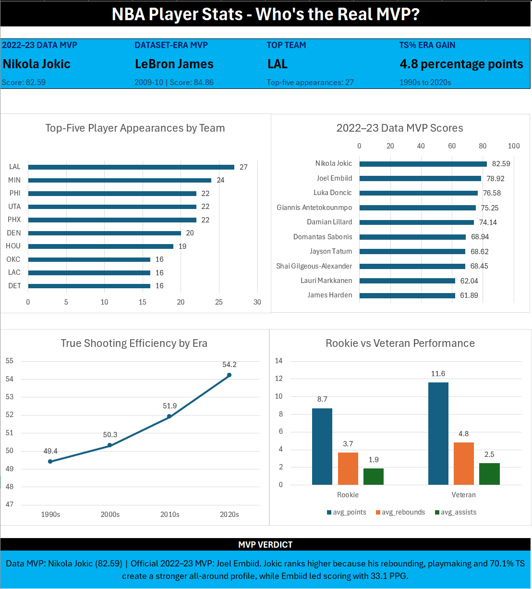

# NBA Player Stats — Who's the Real MVP?

An Excel and SQL analysis of NBA player statistics from the 1996–97 through 2022–23 seasons. The project explores player performance, efficiency, era trends, team success and data-driven MVP selection.

## Dashboard Preview

## Tools

- Microsoft Excel

- SQL Server

- SQL Server Management Studio

## Analysis

- Seasonal scoring, rebounding and playmaking leaders

- Usage rate versus true-shooting efficiency

- Most-improved players across consecutive seasons

- Player size and performance by era

- Teams producing the most top performers

- Rookie versus veteran contributions

- Weighted Data MVP rankings

- All-time dream starting five

## Key Findings

- Nikola Jokic is the 2022–23 Data MVP with a score of 82.59.

- Joel Embiid was the official 2022–23 NBA MVP.

- LeBron James' 2009–10 season has the highest score in the dataset at 84.86.

- True-shooting efficiency increased by 4.8 percentage points from the 1990s to the 2020s.

- The Lakers produced the most top-five player appearances.

- Usage and shooting efficiency had almost no overall correlation.

- Veterans consistently outperformed rookies in production and efficiency.

## Files

- `NBA\_MVP\_Analysis.xlsx` — Excel analysis and dashboard

- `NBA\_MVP\_Project\_Queries.sql` — SQL cleaning and analysis queries

- `NBA\_Stats\_Clean.csv` — Cleaned dataset

